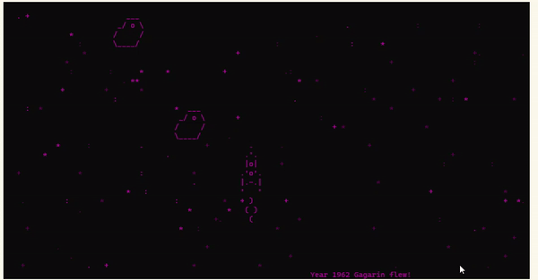

# Space game

A spaceship flies surrounded by blinking stars.



## Prerequisites

- Linux operating system;
- Python 3.10.

## Installing

- Download the project files;
- It is recommended to use [venv](https://docs.python.org/3/library/venv.html?highlight=venv#module-venv) for project isolation.

## Using

- Start a game:

```bash
python game.py
```

- Control the spaceship with the arrows. Avoid crash with garbage;
- There will be a counter of passing years in the lower right corner. Since 2020 you can shoot the garbage with a gun (use the space key).

## Project goals

The project was created for educational purposes.
It's a lesson for python and web developers at [Devman](https://dvmn.org).
